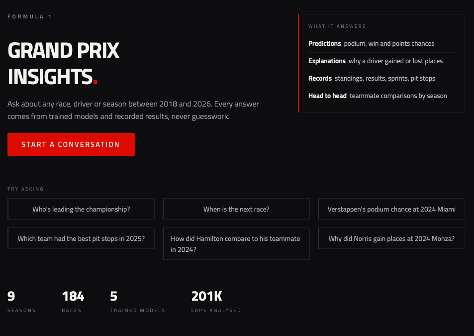

# Grand Prix Insights

**[Try the chatbot →](https://pramodkumar26-f1-grand-prix-insights-predicti-chatbotapp-jyllrt.streamlit.app/)**

This is a Formula 1 data project where I pull real race data from 2018
through the current 2026 season and use it to build machine learning
models. The real work here wasn't just training models, it was deciding
what deserved one in the first place. Every target got asked the same
question before any model touched it: is this actually predictable, or is
it something I can just measure directly, or is the pattern not really
there at all. Five turned out genuinely predictable and became trained
models. Two turned out to have a directly countable answer and became
scorecards instead, no model needed. Three got a real, thorough attempt
and were closed once the data made clear the pattern wasn't reliable
enough to trust. On top of all of it sits a chatbot that only ever answers from
those model outputs and the real race records in the database, never from
its own general knowledge, and it says so plainly whenever a question
falls outside what it actually has.



The scorecards skip MLflow entirely, on purpose, since there's no model
there to version, just a query. The chatbot is the only thing that talks
to Gemini, and Gemini is only ever allowed to respond by calling one of
its 18 tools, nothing it says is allowed to come from its own training
data.

## What the data looks like

All the race data comes from FastF1 and is stored in a SQLite database.
It covers lap times, race results, weather, qualifying, and race control
messages (things like flags and safety cars) across 9 seasons, with 2026
still in progress and refreshed as new races happen.

## What I found while exploring the data

Before building anything, I spent time going through the data carefully to
make sure it could actually be trusted. A few things stood out.

Some of the data had real bugs hiding in it. One table had race IDs stored
in a broken format that silently made every join fail. Another important
column was completely empty and had to be rebuilt from other data that was
already there. And two teams had gotten split into duplicate entries
because of a rebrand, which would have quietly messed up any stats for
that team.

Some things that looked wrong at first turned out to be correct once I
understood the reason behind them. For example, a few laps had extremely
long lap times, and it turned out that was because of an actual red flag
and race restart, not bad data.

Once the data was cleaned up, a few real patterns showed up. Tyres do wear
down over a race, but you only see it clearly once you account for the car
getting lighter as fuel burns off. Starting position is a decent predictor
of where a driver finishes, but it's a much stronger predictor near the
front of the grid than in the middle or back of the field.

Overall, this exploration step mattered a lot. It caught real problems
before they could quietly break any model, and it confirmed that the
patterns I'm hoping to model are actually present in the data, not just
assumptions.

## Turning the data into features

Before any model, there was a separate phase just for building features
out of the raw data, things like how strong a team's car has been
recently, how a driver's pace compares to their own teammate that
weekend, how much a driver's tyres actually wore down once fuel burning
off is accounted for, and how early or late a team tends to pit relative
to the rest of the field. Every one of these is built so it only ever
looks at information that would genuinely have been available at the
time, not something borrowed from later in the same race, unless a model
is deliberately meant to explain a race that already happened rather than
predict one that hasn't happened yet.

## The models that worked

These are the five that passed that first test and actually became
trained models. The two that turned into scorecards instead, and the
three that got closed, are further down, each with the reasoning behind it.

| model | what it predicts | result |
|---|---|---|
| podium | whether a driver finishes in the top 3 | ranks podium finishers above non-finishers correctly about 94% of the time, the cleanest result of the project, mostly because grid position and car strength are genuinely very predictive of a podium in real F1 |
| win | whether a driver finishes 1st | about 95%, cheap to build once podium already existed, and it showed something genuinely different, a competitive car and a clean race is enough to reach the podium, but winning outright takes real car dominance |
| points scored | championship points earned in a race | explains around 72% of the variation, the strongest predictive result of everything I built, and it fills a real gap podium leaves, most of the grid never actually podiums |
| strategy shift | positions gained or lost versus grid position, and why | explains a bit under half, allowed to use information from during the race itself since its job is explaining a race that already happened, not forecasting one, a real chunk of what's left is other drivers crashing or a safety car landing at the right or wrong moment, which nothing can predict |
| overtaking | track position gained over a race | the weakest of the five at around 16%, and it measures net position gained, not pure passing, some of the signal is just benefiting from a rival's pit stop timing, the two aren't cleanly separable with the data I have. that number moved down from 20% once the 2026 season was folded in, but the actual prediction error barely changed, it's because 2026's races so far have had less overtaking spread to explain, not a weaker model, checked directly rather than just taking the drop at face value |

## Two things that turned out to be counted, not modeled

Teammate comparison and pit stop execution both turned out to be
questions with a directly countable answer. Building a model to estimate
something that can just be measured would only add error, not remove it,
so both of these became scorecards instead, a head to head record between
teammates, and a team level pit stop execution ranking.

## Three things I tried and closed

Tyre degradation and DNF prediction both got a real, thorough attempt and
both got closed, not because the modeling was weak but because the
pattern genuinely isn't predictable in this data. Tyre wear at a given
circuit barely repeats from one season to the next. Team reliability is
stable year over year, but which specific driver retires from which
specific race is dominated by things like crashes, which are close to
random.

Sprint race prediction is the third, and it's the one I'd have most
expected to work. Sprint qualifying happens before the sprint, so the
grid is a known fact rather than a guess, which makes it look like a fair
target. I pulled the sprint qualifying data, built sprint-specific pace
features out of the real lap times, and tested twelve different setups
using leave-one-weekend-out cross validation. Every one of them was worse
at picking sprint podiums and winners than just reading the starting grid
order. That makes sense once you think about it, since a sprint is short
and has no mandatory pit stop, so far less can reorder the field than in
a full race. The chatbot now declines sprint predictions and gives you
the real grid instead, which is both more honest and more accurate.

All three are documented in full rather than abandoned quietly, the
reasoning behind why something doesn't work is still a real result.

## Explaining the predictions, not just stating them

A number on its own isn't that useful. I added SHAP on top of the models
complex enough to actually need it, so a prediction comes with a
breakdown of which factors pushed it up and which pushed it down, not
just the final number on its own. The simplest of the five models
explains itself well enough through its own coefficients that SHAP
wouldn't have added anything.

## Tracking the models properly

I set up MLflow locally to track every model's training runs, the simple
baseline it was compared against and the model that actually got adopted,
not just the final number. The adopted models are registered there by
name, so anything downstream, eventually the chatbot, can ask for the
current version of a model instead of depending on raw files.

## The chatbot

The models, the scorecards, and the tracking above are the inputs. The
chatbot is what turns them into something you can actually talk to. It's a
Streamlit app that talks to Google Gemini, and the important part is that
Gemini never answers from its own knowledge. Every answer has to come back
through one of eighteen tools that either run a trained model or read a
real record out of the database.

Those tools split into three kinds, and the chatbot is required to speak
about them differently:

- Straight facts, like championship and constructor standings, a driver's
  full season results and career totals, the full season calendar, what
  happened in a given race, the official race control messages from it,
  teammate head to heads, pit stop rankings, sprint qualifying and sprint
  results, and when the next race is. These get stated plainly, because
  they already happened.
- Model predictions for podium, win, and points. These always come with
  the reason attached, pulled from the same SHAP values described above,
  so it says why it thinks that and not just a bare number.
- The overtaking estimate, which the model only explains a small share of.
  This one is never allowed to state a number at all, only whether it's
  more or less than typical for that grid slot.

The strategy shift model is treated separately again, because it uses
things that happened during the race. It's only ever allowed to explain a
race that already finished, never to predict one.

It also predicts the next race properly, which is the part the models were
actually built for. Once a race weekend has qualified, it gives podium and
win chances for every driver on that grid, ordered, using the same trained
models and the same five features they learned from. Before qualifying it
says it can't, and explains why rather than just refusing, since the
starting grid is the strongest single input the models use and there's
nothing real to predict from without it.

Getting that right needed two things the pipeline didn't have. Qualifying
classification had never been pulled, so the only starting grid in the
database came from the race results table, which by definition only exists
after the race has already been run. And every feature table is built from
the race results too, so a race that hasn't happened gets no features at
all. Both are now handled, and the trailing features rebuilt on demand for
an upcoming race were checked against the ones the training pipeline
stored, matching exactly across every row tested, so a prediction runs on
the same numbers the models were trained on rather than something close to
them.

One honest limitation comes with it. Grid penalties are applied after
qualifying and aren't published anywhere readable before the race, so a
penalised driver may actually start further back than the prediction
assumes. I measured what that costs rather than guessing: about 0.003 of
accuracy, since most penalties shift a driver by a single place. The
chatbot passes that caveat on rather than hiding it.


## Running it

The chatbot needs a Google Gemini API key, on the free tier. Put it in
`.streamlit/secrets.toml`, which is gitignored and never committed:

```
GEMINI_API_KEY = "your-key-here"
```

Then install and run:

```
pip install -r requirements.txt
streamlit run chatbot/app.py
```

The models load out of the MLflow registry rather than from loose files,
so `mlflow.db` and `mlruns/` need to be present, and they're both in the
repo. To browse the tracked runs and compare model versions directly:

```
mlflow ui --backend-store-uri sqlite:///mlflow.db --port 5001
```

## Staying up to date without retraining blindly

A GitHub Actions workflow pulls each new race weekend automatically once
a day, so the database no longer depends on someone running the pipeline
by hand. Retraining stays a manual step on purpose, and the workflow
enforces that by never touching anything under `modeling/`. Every model
in this project got compared against the previous version before being
adopted, and a job that silently swapped models out on a schedule would
throw that discipline away for the sake of convenience.

## Where the project's scope actually starts, and why

The dataset covers 2018 onward, which is where FastF1's lap-by-lap data
starts. Race results and standings go back to 1950 through other sources,
but that data would only ever reach the chatbot's fact-lookup tools, not
the 5 trained models, since those need lap and qualifying data that
doesn't exist for older seasons. Mixing "the chatbot knows this for real"
with "the chatbot can only look this fact up" inside one conversation is
more confusing than useful, so 2018 onward stays the intentional edge of
what this project covers, not just where the easy data ran out.
